# **Final Consolidated Granular Plan: Quantifying Redundancy in Biomedical Literature**

## 1. Introduction & Core Principles

### **1.1. Executive Summary**

This plan outlines a system to quantify the redundancy of RCTs by measuring the **novel contribution** of each paper. The method transforms each paper into a structured **knowledge graph** and compares it against a cumulative knowledge base within a rolling temporal window (e.g., 5 years). It combines structural graph analysis (claim-level novelty) with semantic vector embeddings (holistic similarity) for a dual-faceted redundancy score. The pipeline is modular, deterministic, and bias-free, ensuring consistent outputs regardless of abstract phrasing, structure, or lexical variations.

### **1.2. The Research Question**

> **How can we quantify the redundancy of a biomedical RCT by measuring the novel contribution its knowledge graph representation makes to a cumulative knowledge graph of the preceding *W* years?**

### **1.3. Core Principles & Assumptions**

- **Temporal Redundancy**: A paper's contribution is measured against the knowledge that **precedes it**.
- **Corpus Specificity**: The analysis requires a **homogeneous corpus** of RCTs in a single clinical domain (e.g., cardiovascular interventions like "PCI vs. CABG for coronary artery disease").
- **Researcher-Led Curation**: The initial corpus is defined by an expert who provides PubMed IDs (PMIDs); the system does not perform literature searches.
- **The Temporal Window**: Redundancy is assessed against **contemporary, active knowledge** (e.g., last 5 years) to model scientific progress and ensure computational efficiency.
- **Determinism and Bias Mitigation**: All steps use fixed models, rule-based heuristics, and canonical normalization (e.g., UMLS CUIs) to ensure outputs are reproducible and independent of phrasing or structure.

-----

## 2. Phase 1: Data Curation & Validation

**Objective**: To fetch, validate, and chronologically sort the corpus metadata from a researcher-curated list of PMIDs.

- **Input**: `pmids.txt` (list of PMIDs).
- **Script**: `1_fetch_data.py`.
- **Process** (Granular Steps):
  1. **Read PMIDs**: Ingest the list, remove duplicates using `set()`, and log any removals.
  2. **Fetch Metadata**: Use NCBI Entrez API via BioPython to retrieve `PMID`, `Publication Date`, `Title`, `Abstract`, `Authors`, and `Journal` in batches (e.g., 100 PMIDs) to respect rate limits. Implement exponential backoff retries (e.g., delays of 1s, 2s, 4s) for failures.
  3. **Date Standardization**: Prioritize fields: `PubDate` > `EPubDate` > `MedlineDate`. For incomplete dates:
     - Year-month (e.g., "2023 Mar"): Impute midpoint (e.g., "2023-03-15").
     - Year-only (e.g., "2023"): Impute mid-year (e.g., "2023-07-01").
     - Log all imputations in `phase1_log.txt` for audit.
  4. **Validate Data**: Flag duplicates (keep earliest date), missing abstracts (skip in later phases), or invalid PMIDs. Generate a summary stats file (e.g., `phase1_summary.csv`: total papers, missing abstracts percentage).
  5. **Sort Chronologically**: Sort by standardized date (ascending); use Pandas `sort_values('PubDate')`.
- **Output**: `corpus_sorted.csv` (with columns: PMID, Title, Abstract, Authors, Journal, PubDate, Missing_Abstract flag); `phase1_log.txt`; `phase1_summary.csv`.

**Code Snippet** (Core Fetch Logic):
```python
from Bio import Entrez
import pandas as pd
import time
from datetime import datetime, date
import logging

logging.basicConfig(filename='phase1_log.txt', level=logging.INFO)
Entrez.email = "your.email@example.com"
Entrez.api_key = "your_ncbi_api_key"

def parse_date(article):
    # Prioritization and imputation logic as described
    # ...

def fetch_with_retry(pmid_batch, retries=3):
    # Exponential backoff implementation
    # ...

# Main: Read, fetch, standardize, validate, sort, output
```

-----

## 3. Phase 2: PICO-Centric Knowledge Extraction

**Objective**: To transform each abstract into structured, canonical claims (JSON) and a semantic embedding (.npy) using a deterministic, bias-free "funnel-and-focus" pipeline. This ensures outputs are independent of phrasing/structure by normalizing to UMLS CUIs and standardized formats.

- **Input**: `corpus_sorted.csv`.
- **Script**: `2_extract_data.py`.
- **Granular Pipeline** (Deterministic and Bias-Free Design):
  The pipeline uses fixed pre-trained models (e.g., no runtime fine-tuning), rule-based heuristics, and weak supervision (offline-trained) to eliminate randomness and biases. Weak supervision aggregates diverse labeling functions (LFs: ontologies, regex, heuristics) via majority vote for reproducibility.

```mermaid
graph TD
    subgraph "INPUT"
        A["📄 Title + Abstract Text"]
    end

    subgraph "PREPROCESSING"
        A --> B["Text Normalization<br/>(Lowercase, Punctuation Removal, Abbreviation Expansion)"]
    end

    subgraph "Isolate Key Sentences"
        B --> C["Sentence Tokenization & Classification<br/>(Fixed SciBERT Classifier: RESULTS/CONCLUSION)"]
        C --> D{"Filter & Select<br/>Top 1-3 Sentences (Confidence >0.7)"} --> E["🎯 Key Sentences (or Flag Skip if None)"]
    end

    subgraph "TARGETED EXTRACTION"
        E --> F["PICO NER (Weak Supervision Model)<br/>(Extract P, I, O Entities)"]
        F --> G["Targeted UMLS Linking<br/>(Canonical CUIs for I/O)"]
        E --> H["Stats & Context NER (Weak Supervision Model)<br/>(Extract STATISTICAL, CONTEXTUAL_MODIFIER)"]
        H --> I["Evidence Normalization<br/>(Standardize Formats, e.g., p-value to Float + Qualifier)"]
    end

    subgraph "ASSEMBLY"
        G & I --> J["Claim Assembly (Rule-Based)<br/>(Pair I-O, Predict Relation (BioLinkBERT/REaMA),<br/>Rule-Based Polarity/Certainty,<br/>Dependency Parsing for Linking)"]
        J --> K["Dedup & Canonical JSON Claims"]
    end

    subgraph "SEMANTIC"
        B --> L["Embedding Generation<br/>(PubMedBERT on Full Text)"]
    end

    subgraph "OUTPUT"
        K --> M["{pmid}.json (Claims)"]
        L --> N["{pmid}.npy (Embedding)"]
    end
```



### **3.1. Granular Extraction Steps**

1. **Preprocessing (Text Normalization)**:
   - Lowercase text, remove punctuation (`re.sub(r'[^\w\s]', '', text.lower())`).
   - Tokenize sentences using spaCy's `en_core_sci_lg` sentencizer.
   - Expand abbreviations via scispaCy's AbbreviationDetector.
   - **Bias-Free**: Rule-based, fixed across all inputs.

2. **Sentence Classification**:
   - Use fixed SciBERT model (fine-tuned offline on PubMed RCT dataset) for labels (BACKGROUND, METHODS, RESULTS, CONCLUSION).
   - Select top 1-3 RESULTS/CONCLUSION sentences (confidence >0.7); deterministic tie-breaker by sentence order.
   - Fallback: Rule-based keyword scan (e.g., "results", "findings") if model unavailable.
   - **Bias-Free**: Fixed weights; handles variable abstract structures.

3. **PICO Entity Recognition** (Weak Supervision):
   - **Offline Training**: Aggregate LFs (UMLS for I/O, Human Phenotype Ontology for P, regex like r'(in|among) \w+ patients' for P) via majority vote. Train spaCy/PubMedBERT (seed=42).
   - **Runtime**: Apply model to key sentences; extract P, I, O spans.
   - **Bias-Free**: Diverse LFs cover phrasings; vote aggregation is exact.

4. **Targeted UMLS Linking**:
   - Run scispaCy UmlsEntityLinker (threshold=0.85) only on I/O spans.
   - Store as {"text": original, "cui": CUI or "UNLINKED"}.
   - **Bias-Free**: Ontology-based, phrasing-independent.

5. **Evidence & Context Extraction**:
   - Weak supervision model for STATISTICAL (e.g., regex r'p\s?[=<>]\s?0\.\d+') and CONTEXTUAL_MODIFIER (e.g., dosage patterns).
   - Normalize: e.g., "p < 0.05" → {"type": "P_VALUE", "value": 0.05, "qualifier": "less_than"}.
   - **Bias-Free**: Exact regex and rules.

6. **Deterministic Claim Assembly**:
   - Pair I (subject) with O (object); predict relation using fixed BioLinkBERT or REaMA (2025 SOTA).
   - Polarity/Certainty: Rule-based scan (negation: "not", "no"; hedges: "may", "could").
   - Link evidence: spaCy dependency parser to attach stats (deterministic tree traversal).
   - Canonical JSON: {"pico": {"population": ..., "intervention": {"cui": ...}, "outcome": {"cui": ...}}, "relation": ..., "polarity": ..., "certainty": ..., "evidence": [...] }.
   - Dedup: Exact JSON match within paper.
   - **Bias-Free**: Rules and fixed models.

7. **Semantic Embedding Generation**:
   - Feed full title+abstract to PubMedBERT via sentence-transformers.
   - Save as .npy (NumPy array).

8. **Quality Control**:
   - Flag if <1 claim or no CUIs; log outliers (>10 claims).
   - Parallelize with `multiprocessing.Pool(processes=4)`.

**Code Snippet** (Assembly Example):
```python
import hashlib
import json
# ... model loads

def assemble_claim(key_sentence, pico, evidence):
    # Relation prediction, polarity rules, dependency linking
    claim = {
        "pico": pico,  # With CUIs
        "relation": relation_extractor(key_sentence)[0]['relation'],
        "polarity": 'positive' if not any(neg in key_sentence.lower() for neg in ['not', 'no']) else 'negative',
        # ... certainty, evidence
    }
    return claim

# Hash for Phase 3 prep (canonical key)
def canonical_claim_key(claim):
    evidence_str = json.dumps(claim['evidence'], sort_keys=True)
    components = [claim['pico']['intervention']['cui'], claim['relation'], claim['pico']['outcome']['cui'], ...]
    key = '_'.join(components)
    return hashlib.sha256(key.encode()).hexdigest()
```

-----

## 4. Phase 3: Temporal Analysis & Dual Scoring

**Objective**: To calculate a robust redundancy assessment by comparing each paper to predecessors in a rolling window (*W* years).

- **Input**: Sorted `{pmid}.json` and `{pmid}.npy`.
- **Script**: `3_analyze_redundancy.py`.

### **4.1. Granular Implementation Details**

1. **Initialization**:
   - Define *W* (e.g., 5 years, tunable).
   - `KG_window`: Dict {hash: [(pmid, ESS, pub_date)]}.
   - `Embedding_window`: FAISS index for embeddings.

2. **Hyperparameter Tuning** (Offline):
   - Use optuna (fixed seed=42) on 70% corpus against gold standard (expert-annotated novelty).
   - Tune: *W*, ESS weights (w_n, w_ci, etc.), thresholds, k (for semantic).

3. **Structural Redundancy Calculation** (Deterministic):
   - **Per Claim ESS**: ESS = (w_n * log(N or 1)) + (w_ci * (1 / (CI_upper - CI_lower or 1))) + (w_e * abs(log(EffectSize or 1))) + (w_p * -log10(p or 1)). Normalize missing: Divide by sum(available weights).
   - **Claim Hashing**: SHA-256 on canonical string (sorted: subject_CUI, relation, object_CUI, polarity, certainty, context_CUIs, evidence_JSON).
   - **Classification** (Rule-Based via KG Query):
     - Match hash? Compare polarity/ESS:
       - Same polarity, ESS ±20%: Redundant (weight=0).
       - Same polarity: Confirmatory (weight=0.2).
       - Opposite: Contradictory (weight=1.0).
     - No match: Novel (weight=0.8 if new link; 1.0 if new CUI).
   - **Aggregate**: C_total = sum(weights) / num_claims. Structural_Redundancy = 1 - C_total (0=novel, 1=redundant).
   - **Bias-Free**: Exact matches and rules.

4. **Semantic Redundancy Calculation**:
   - Query FAISS for top-k neighbors (k tuned, e.g., 5).
   - Semantic_Redundancy = average(cosine similarities).

5. **Combined Assessment**:
   - High Confidence Redundant: Structural >0.8 AND Semantic >0.9.
   - High Confidence Novel: Structural <0.3 AND Semantic <0.6.
   - Flag Review: |Structural - Semantic| >0.3 (disagreement).
   - First papers: Redundancy=0.

6. **Update Windows**: Add new claims/embedding; purge >*W* old.

- **Output**: `results.csv` (PMID, Structural_Redundancy, Semantic_Redundancy, Assessment, Classifications).

**Code Snippet** (Core Logic):
```python
import faiss
import numpy as np
import optuna  # For tuning

# Offline tuning example
def objective(trial):
    w_n = trial.suggest_float('w_n', 0.1, 1.0)
    # ... minimize error on gold standard

# Runtime: ESS calc
def calc_ess(claim):
    evidence = claim['evidence']
    terms = [w_n * np.log(evidence.get('N', 1)), ...]  # All terms
    available = [t for t in terms if not np.isnan(t)]
    return sum(available) / sum(weights for w, t in zip(all_weights, terms) if not np.isnan(t))

# Classification and aggregation as described
```

-----

## 5. Phase 4: Persistence & Visualization

**Objective**: To store results for exploration and visualize trends interactively.

- **Input**: `results.csv`, `{pmid}.json`.
- **Scripts**: `4a_visualize.py`, `4b_load_to_neo4j.py`.

### **5.1. Granular Implementation Details**

1. **Graph Persistence**:
   - Use Neo4j APOC for bulk import: Nodes for Concepts (CUIs), Papers (PMID), Claims; edges for relations/evidence.
   - Add indexes on CUIs for query speed.

2. **Interactive Visualization** (Using Plotly/Dash):
   - Time-series: Redundancy trends over PubDate.
   - Histograms: Score distributions.
   - Scatter: Structural vs. Semantic, color by Assessment.
   - Dashboard: Integrate with Dash for zoom/interactivity.

- **Output**: Interactive HTML plots; populated Neo4j; summary CSV with Cypher queries (e.g., "MATCH (p:Paper {pmid: '123'}) RETURN p").

**Code Snippet** (Dash Example):
```python
from dash import Dash, dcc, html
import plotly.express as px
import pandas as pd

app = Dash(__name__)
df = pd.read_csv('results.csv')
fig_scatter = px.scatter(df, x='Structural_Redundancy', y='Semantic_Redundancy', color='Assessment')
app.layout = html.Div([dcc.Graph(figure=fig_scatter)])
app.run_server(debug=True)
```

-----

## 6. Validation & Impact

### **6.1. Validation & Quality Assurance**

- **Hyperparameter Optimization**: Optuna on training subset vs. gold standard (20+ annotated RCTs).
- **Error Analysis**: Review disagreement cases; compute precision/recall for claims (target F1 >0.85).
- **Inter-Annotator Agreement**: Multiple experts annotate gold standard; target Cohen's Kappa >0.8; resolve via discussion.
- **Determinism Test**: Run pipeline twice on same corpus; assert identical outputs.
- **Bias Audit**: Test on diverse abstracts (e.g., varying lengths, phrasings); ensure uniform performance.

### **6.2. Impact & Future Work**

- **Expected Outcomes**: Tools for research gap identification, editorial decisions, and efficient literature reviews.
- **Future Extensions**: (1) Full-text analysis; (2) Integrate quality metrics (e.g., Cochrane Risk-of-Bias into ESS); (3) Multi-domain adaptation; (4) LLM hybrids for zero-shot extraction.